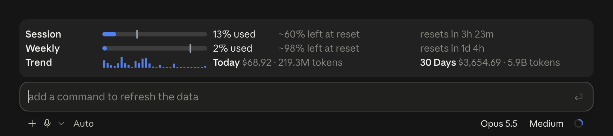

# ClaudeUsageMod

A Claude Code mod, `claude-usage`, that shows your Claude usage in a band above the prompt.



The band works in the Code tab of the Claude desktop app and in the terminal.

## What it shows

- **Session and Weekly:** the rate limit windows of your subscription. The bar shows the % used. The gray line shows how much of the window's time passed. Hover a bar to see the explanation.
- **~X% left at reset:** the part of the limit that you will have left at reset if you continue at the same rate.
- **Extra Usage:** a third bar that shows when your account has a spend limit.
- **Trend:** the cost for each of the last 30 days.
- **Today and 30 Days:** the cost and the tokens for each range.

## Requirements

- Claude Code with function hooks (mods). I tested the mod with version 2.1.289.
- `/usr/bin/python3`. macOS has it after you install the Xcode Command Line Tools.
- A Claude subscription for the Session and Weekly bars. Without a subscription, the band shows only the trend and the totals.

## Install

1. Clone the repository:

   ```bash
   git clone https://github.com/alecspopa/ClaudeUsageMod.git ~/Work/ClaudeUsageMod
   ```

2. Add the folder to the `env` block of `~/.claude/settings.json`:

   ```json
   {
     "env": {
       "CLAUDE_CODE_PLUGIN_DIRS": "/Users/<you>/Work/ClaudeUsageMod"
     }
   }
   ```

   Use the absolute path of your clone. To load more than one mod folder, separate the paths with `:`.

3. Start a new session. The band shows above the prompt.

This setting works for the desktop app and for the terminal. To try the mod in one terminal session only, start Claude Code with the folder:

```bash
claude --plugin-dir ~/Work/ClaudeUsageMod
```

## Uninstall

Remove the path from `CLAUDE_CODE_PLUGIN_DIRS` and start a new session. Then you can remove the cache folder `~/.cache/claude-usage`.

## How it works

- **Rate limits:** the mod reads the limits from `$.session.usage()` and from the `session.measure` event. It keeps the last reading, so that a new session shows the limits before its first response.
- **Cost and tokens:** `scripts/scan.py` reads the transcripts in `~/.claude/projects`, or in `$CLAUDE_CONFIG_DIR/projects` when you set that variable. It reads only the files that changed in the last 30 days.
- **Duplicates:** a resumed session copies earlier rows. The scan counts each response one time only, by its message id and request id.
- **Cache:** the scan keeps the result for each file in `~/.cache/claude-usage/scan.json`. It reads a file again only when its size or time changes.
- **Updates:** the scan runs when the session starts, every 5 minutes, and after each response that costs money.

The cost is an estimate at the API list prices, which are in `PRICES` in `scripts/scan.py`. A subscription does not bill these amounts. Update the table when the prices change.

## Develop

Run the checks from the repository folder:

```bash
claude plugin validate .
```

```bash
claude plugin test .
```

Claude Code writes the API types to `.claude-plugin/types/` each time it loads the mod. Git ignores that folder.
